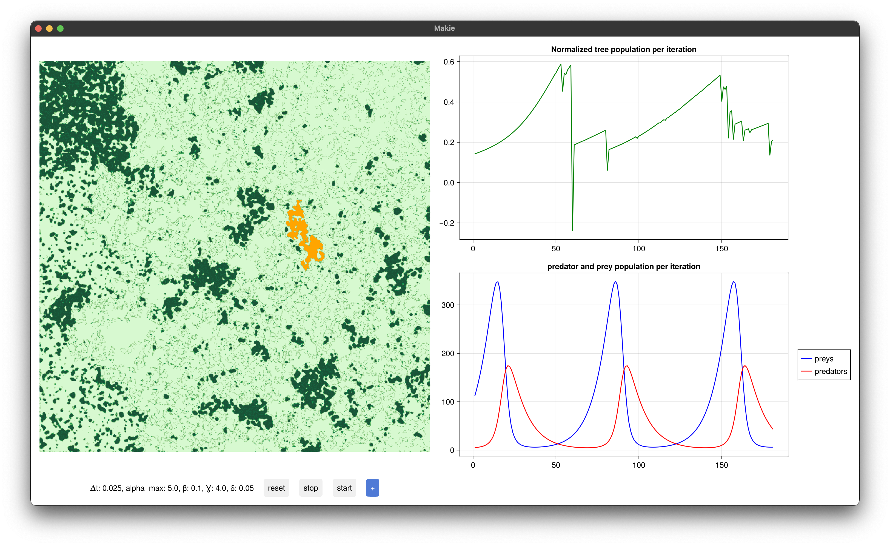
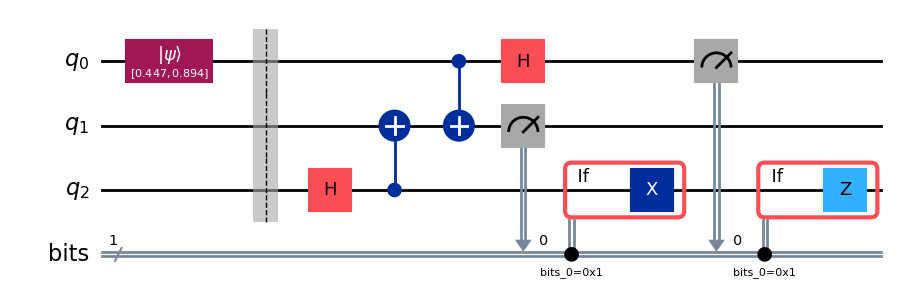
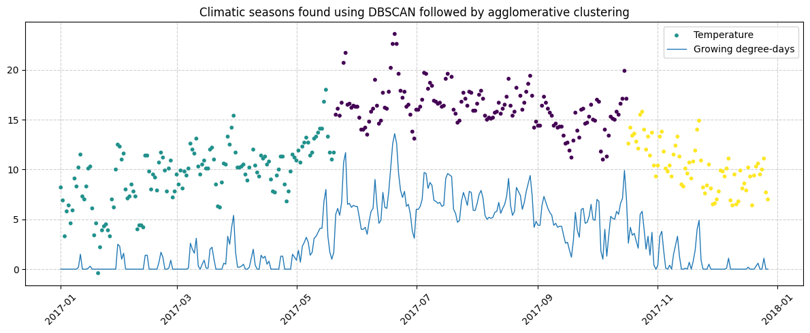
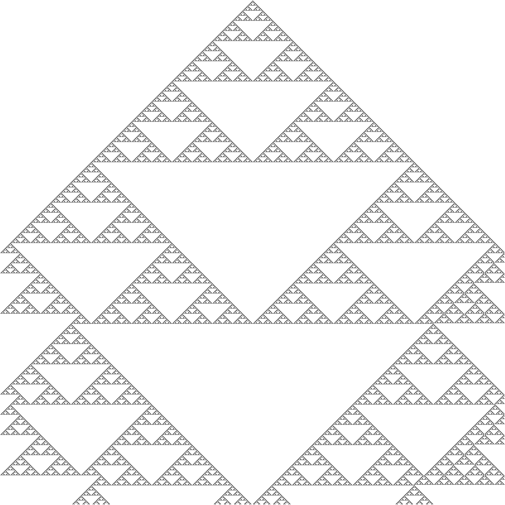

<!--
**IronMax03/IronMax03** is a ✨ special ✨ repository because its `README.md` appears on your GitHub profile.

> I am Maximilien, a computer science student combining theory (algorithms, quantum information, physics and math) with applied engineering (C++ systems, Julia/Python scientific computing).
> Open to internship opportunities in R&D, scientific computing and software engineering, based in Geneva, Switzerland.
-->

  

> I am Maximilien, a computer science student combining theory with applied engineering (C++ systems, Julia/Python scientific computing).
> Open to internship opportunities in R&D, scientific computing and software engineering, based in Geneva, Switzerland.

---

### 🧰 Languages & Tools

  

  

---

### ⭐ Featured Projects
#### Projects
<!-- - [KnotLib](https://github.com/IronMax03/KnotLib) — Experimental C++20 library for computational knot theory; implements core invariants and explores efficient representations bridging math and code.-->
- [wildfireSim](https://github.com/IronMax03/wildfireSim) - An ecosystem simulator that models vegetation growth with a stochastic cellular automaton, wildfires triggered by lightning strikes, and predator–prey interactions.
- [DEBUG_MODE](https://github.com/IronMax03/DEBUG_MODE) — Lightweight C++ debugging helper with variable tracking; non-intrusive and easy to integrate for faster iteration.
- [Maze Generator With Cellular Automaton](https://github.com/IronMax03/Maze_Generator_With_Cellular_Automaton) — Cellular automaton that converts random noise into maze structures.

#### Mini Projects
- [Mandelbrot Set](https://gist.github.com/IronMax03/cb4b31312ade81716c42453aa2c8326d) — High-resolution smooth-color renderer of the Mandelbrot set in Julia.
- [Quantum Teleportation](https://gist.github.com/IronMax03/d7129ba60978fdd5a47e13fe898863c2) — 1‑qubit implementation of the quantum teleportation protocol using Qiskit.

#### Gallery

  
  
   
  
  **(1)** Mandelbrot renderer **(2)** Cellular Automato Maze generator. **(3)** A ecosystem simulator that models vegetation growth, wildfires, and predator–prey interactions.
  

Click for more images

   

  **(4)** 1-qubit quantum teleportation circuit.

  

  **(5)** Climatic seasons & GDD clustering (wine-production analysis)..

 **(6)** Sierpiński triangle generated by rule 90 (elementary cellular automaton).

<!--
---

### 🔭 Current Learning

#### Quantum information
- **Focus & Goal:** Quantum Algorithms and Quantum Simulations.
- **Learning:** quantum mechanics foundations and quantum information theory.

#### Scientific computing (Julia/Python)
- **Focus & Goal:** numerical simulation.
- **Learning:** Julia programming basics and scientific Python tooling.

#### Systems/C++
- **Focus:** lightweight libraries and performance.
- **Learning:** modern C++ (C++20/23).-->

<!--
## 📊 GitHub Stats

-->

  

<!-- Optional: Add links below -->
<!--
### 🌐 Connect with Me

-->
